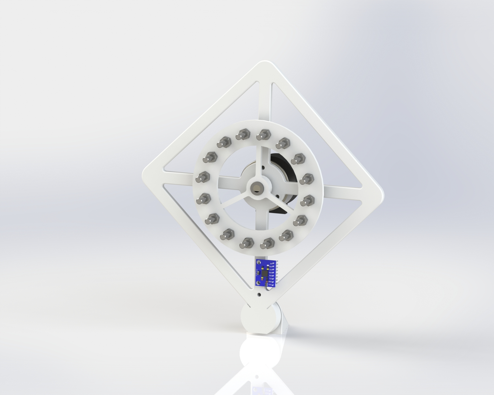

# 🛰️ Reaction Wheel Inverted Pendulum

This repository contains all hardware and software resources for the **Reaction Wheel Inverted Pendulum** project — a physical model of a CubeSat's attitude correction and control system. Developed as part of a Bachelor of Engineering (Honours) in Mechatronics at TU Dublin, the system demonstrates closed-loop stabilization using reaction wheels, an IMU, and PID-based control.

  
*Figure: 3D render of the Reaction Wheel Inverted Pendulum prototype*

---

## 📦 Repository Structure

0. **Documentation**  
   - `RWIP-ProjectReport.pdf` – Full project report with modelling, design, and results

1. **Electrical**  
   - `KiCAD-PCB/` – Custom PCB for ATmega328P-based MCU, IMU, and power electronics  
   - Includes schematics, PCB layout, and Gerber files

2. **Mechanical**  
   - `SolidWorks-Assembly/` – Full CAD model of the pendulum frame and flywheel  
   - `STL-Files/` – 3D-printable parts for prototyping the mechanical structure

3. **Software**  
   - `Firmware/` – Microcontroller code for ATmega328P (Arduino-compatible)  
   - Implements sensor fusion (complementary & Kalman filters), cascade PID control, and encoder-based velocity feedback

---

## 🧠 Project Overview

This project simulates and physically demonstrates a 1U CubeSat’s ability to stabilize itself using internal momentum exchange via a reaction wheel. The system uses:

- **IMU**: MPU6050 (accelerometer + gyroscope)
- **Motor**: Nidec 24H brushless DC motor with encoder
- **MCU**: ATmega328P (Arduino Uno or custom PCB)
- **Control System**: Cascaded PID controller with feedback from IMU and encoder

---

## 🔬 Key Features

- Real-time stabilization of a pendulum system using reaction wheels
- Sensor fusion for clean angular state estimation (Kalman & complementary filters)
- Encoder RPM feedback and motor driver interface
- Fully 3D-printed mechanical structure with adjustable flywheel inertia
- Simulation-backed control strategy using Lagrangian modelling and Simulink validation

---

## 🛠️ Hardware Requirements

- ATmega328P MCU (Arduino Uno or custom PCB)
- MPU6050 IMU
- Nidec 24H brushless motor with integrated encoder
- 12V power supply and 5V linear regulator (LM7805)
- Reaction wheel (3D printed) with modular mass placement
- Supporting frame, bearings, and wiring

---

## 🧩 Software Features

- **Sensor integration**: I²C communication with MPU6050
- **State estimation**: Complementary and Kalman filtering
- **Control logic**: Cascaded PID loop with independent tuning
- **Motor interface**: PWM, direction, and brake pin management
- **Encoder**: Speed and direction estimation via interrupts
- **Serial monitoring**: Real-time feedback and tuning via PC interface

---

## 📚 Documentation

📄 The full design process, test results, simulations, and implementation details are documented in the [Project Report (PDF)](./0.Documentation/RWIP-ProjectReport.pdf).

---

## 🚀 Getting Started

### Setup Steps

1. **Assemble mechanical parts** using STL files or the full SolidWorks model
2. **Build the PCB** or use an Arduino Uno with the schematic provided
3. **Upload firmware** from `/Firmware` using Arduino IDE
4. **Power the system** with regulated 12V/5V supply
5. **View system behavior** and tune via Serial Plotter or Monitor

---

## 🔧 Control Strategy

- Inner loop: motor velocity PID control based on encoder feedback
- Outer loop: angle stabilization PID using fused IMU angle
- Designed and tuned iteratively based on test results and Simulink simulations

---

## 🧪 Future Work

- Expand to 3-axis stabilization using multiple wheels
- Switch to space-ready components for orbital deployment
- Integrate solar power system with MPPT for autonomous CubeSat operation
- Implement advanced control (LQR, SMC, nonlinear backstepping)

---

## 📝 License

This project is open-source and distributed under the terms of the [GNU General Public License v3.0 (GPL-3.0)](./LICENSE).

---

## 👤 Author

**Ethan Lawlor**  
B.Eng. Mechatronics  
Technological University Dublin
